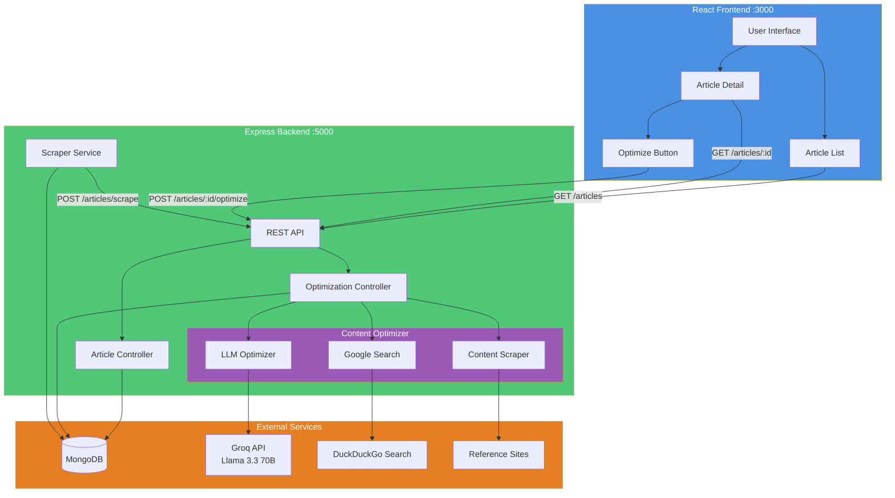

# Web Scraper & Content Optimizer

A comprehensive 3-phase full-stack application that scrapes articles, optimizes them using AI, and displays them in a beautiful React UI.

## Live Demo

https://articles-beyondchats.vercel.app/


Note: The backend is hosted on Render and it may take a minute to wake up after being idle for a while.

## 🚀 Features

### Phase 1: Backend API
- ✅ Web scraping of BeyondChats blog articles
- ✅ MongoDB database storage
- ✅ Full CRUD REST API
- ✅ Support for both original and optimized articles

### Phase 2: Content Optimizer
- ✅ Google Search automation with Puppeteer
- ✅ Web scraping of top-ranking articles
- ✅ AI-powered content optimization using Groq (Llama 3.3 70B)
- ✅ Automatic citation and reference tracking
- ✅ Smart content analysis and rewriting
- ✅ **Integrated into backend API** for on-demand optimization

### Phase 3: React Frontend
- ✅ Modern, responsive UI with dark mode
- ✅ Article browsing with search and filtering
- ✅ Detailed article view with formatted content
- ✅ **One-click article optimization** from UI
- ✅ Real-time progress indicators during optimization
- ✅ Premium design with glassmorphism and animations
- ✅ Error handling and user feedback

## 📁 Project Structure

```
web-scraper/
├── backend/                 # Phase 1: Express API & MongoDB
│   ├── src/
│   │   ├── config/         # Database configuration
│   │   ├── models/         # Mongoose models
│   │   ├── routes/         # API routes
│   │   ├── controllers/    # Route controllers
│   │   ├── services/       # Business logic (scraper)
│   │   └── server.js       # Express server
│   ├── content-optimizer/  # Phase 2: Integrated AI optimizer
│   │   └── src/
│   │       └── services/   # Google Search, Scraper, LLM
│   ├── package.json
│   ├── .env
│   └── README.md
│
└── (root)/                  # Phase 3: React Frontend
    ├── src/
    │   ├── components/     # React components
    │   ├── services/       # API client
    │   ├── styles/         # CSS styling
    │   └── App.js          # Main app with routing
    ├── package.json
    ├── .env
    └── README.md (this file)
```

## 🏗️ System Architecture



## 🔄 Data Flow

```mermaid
sequenceDiagram
    participant User
    participant UI as React App
    participant API as Backend API
    participant DB as MongoDB
    participant Opt as Content Optimizer
    participant Groq as Groq LLM
    
    Note over User,Groq: Article Browsing
    User->>UI: Open app
    UI->>API: GET /articles
    API->>DB: Fetch articles
    DB-->>API: Return data
    API-->>UI: Article list
    UI-->>User: Display articles
    
    Note over User,Groq: Article Optimization
    User->>UI: Click "Optimize"
    UI->>API: POST /articles/:id/optimize
    API->>DB: Fetch original
    DB-->>API: Article data
    API->>Opt: Search Google
    Opt-->>API: Top 2 URLs
    API->>Opt: Scrape content
    Opt-->>API: Reference articles
    API->>Opt: Optimize with LLM
    Opt->>Groq: Send for optimization
    Groq-->>Opt: Optimized content
    Opt-->>API: Return optimized
    API->>DB: Save/Update optimized article
    DB-->>API: Success
    API-->>UI: Optimized article
    UI-->>User: Show success + link
```

## 🛠️ Prerequisites

- **Node.js** v14 or higher
- **MongoDB** (local or Atlas)
- **Groq API Key** ([Get one free here](https://console.groq.com))

## 📦 Installation

### 1. Install Backend (Phase 1)

```bash
cd backend
npm install

# Configure environment
cp .env.example .env
# Edit .env and set your MONGODB_URI
```

### 2. Install Content Optimizer (Phase 2)

```bash
cd content-optimizer
npm install

# Configure environment
cp .env.example .env
# Edit .env and add your GROQ_API_KEY
```

### 3. Install Frontend (Phase 3)

```bash
cd ..  # Back to root
npm install
```

## 🚀 Usage

### Step 1: Start MongoDB

```bash
# If using Docker:
docker run -d -p 27017:27017 --name mongodb mongo:latest

# Or start your local MongoDB instance
```

### Step 2: Start Backend Server

```bash
cd backend
npm run dev
```

Server will start on `http://localhost:5000`

### Step 3: Scrape Initial Articles

```bash
# In a new terminal, make a POST request to scrape articles:
curl -X POST http://localhost:5000/api/articles/scrape

# Or use a REST client like Postman
```

This will scrape 5 articles from BeyondChats blog and store them in MongoDB.

### Step 4: Optimize Articles

**Option A: From the UI (Recommended)**
1. Open the frontend at `http://localhost:3000`
2. Click on any original article (without "Optimized" badge)
3. Click the "✨ Optimize Article" button
4. Wait 30-60 seconds while it processes
5. View the optimized version with references

**Option B: Command Line (Batch Processing)**
```bash
cd content-optimizer
npm start
```

This will:
1. Fetch original articles from the API
2. Search Google for each article title
3. Scrape top 2 ranking articles
4. Use Groq AI (Llama 3.3 70B) to optimize the content
5. Publish optimized versions with citations

### Step 5: Start React Frontend

```bash
cd ..  # Back to root
npm start
```

Frontend will start on `http://localhost:3000`

## 🎨 Features Demo

### Article List
- Search articles by title
- Filter by Original/Optimized
- Premium card-based grid layout
- Responsive design for all devices

### Article Detail
- Full formatted article content
- Author and metadata display
- References section for optimized articles
- Link back to original version
- **"Optimize Article" button** on original articles

### Content Optimization
- **One-click optimization** from article detail page
- Real-time progress indicators (Searching, Scraping, AI Analysis)
- AI analyzes top-ranking Google results
- Rewrites content with improved structure  
- Maintains factual accuracy
- Adds proper citations
- Success/error feedback with user-friendly messages

## 🔧 API Endpoints

### Backend API (Port 5000)

- `POST /api/articles/scrape` - Scrape BeyondChats articles
- `GET /api/articles` - Get all articles (supports filtering)
- `GET /api/articles/:id` - Get single article
- `POST /api/articles` - Create article
- `PUT /api/articles/:id` - Update article
- `DELETE /api/articles/:id` - Delete article
- `POST /api/articles/:id/optimize` - **Optimize an article with AI**

### Query Parameters:
- `isOptimized=true|false` - Filter by optimization status
- `page=1` - Page number for pagination
- `limit=10` - Items per page

## 🎯 Environment Variables

### Backend (.env)
```env
MONGODB_URI=mongodb://localhost:27017/beyondchats-scraper
PORT=5000
NODE_ENV=development
```

### Content Optimizer (.env)
```env
GROQ_API_KEY=your_groq_api_key_here
BACKEND_API_URL=http://localhost:5000/api
```

### Frontend (.env)
```env
REACT_APP_API_URL=http://localhost:5000/api
```

## 🧪 Testing

### Test Backend API
```bash
# Get all articles
curl http://localhost:5000/api/articles

# Get only optimized articles
curl "http://localhost:5000/api/articles?isOptimized=true"

# Get article by ID
curl http://localhost:5000/api/articles/<article_id>
```

### Test Frontend
1. Open `http://localhost:3000`
2. Verify articles display in grid
3. Test search and filtering
4. Click an article to view details
5. Check responsive design (DevTools)

## 📝 Notes

- The scraper targets 5 specific BeyondChats articles
- Content optimizer can run standalone or via API endpoint
- **One-click optimization** available from the UI
- Optimization takes ~30-60 seconds per article
- Puppeteer uses stealth mode to avoid Google detection
- Uses Groq's Llama 3.3 70B model (fast and free)
- Premium UI design with dark mode and glassmorphism effects
- Fully responsive for mobile, tablet, and desktop

## 🐛 Troubleshooting

**Backend won't start:**
- Check if MongoDB is running
- Verify MONGODB_URI in .env

**Content Optimizer fails:**
- Verify GROQ_API_KEY is valid in content-optimizer/.env
- Check backend API is running
- Google may block automated searches (use VPN or delays)
- Ensure timeout is set to 120000ms in frontend api.js

**Optimization button shows error:**
- Check backend logs for detailed error messages
- Verify Groq API key is properly configured
- Ensure article exists and is not already optimized

**Frontend shows no articles:**
- Verify backend is running on port 5000
- Check REACT_APP_API_URL is correct
- Make sure articles were scraped first

## 📄 License

MIT

## 👨‍💻 Author

Built as a demonstration of modern full-stack development with AI integration.

---

**Stack:**
- Backend: Node.js, Express, MongoDB, Mongoose
- Scraping: Axios, Cheerio, Puppeteer
- AI: Groq API (Llama 3.3 70B Versatile)
- Frontend: React, React Router, Axios
- Styling: Custom CSS with modern design patterns

**Key Features:**
- ✨ One-click AI optimization from UI
- 🚀 Fast processing with Groq's infrastructure
- 📊 Real-time progress indicators
- 🎨 Premium, responsive design
- 🔍 Smart Google search integration
